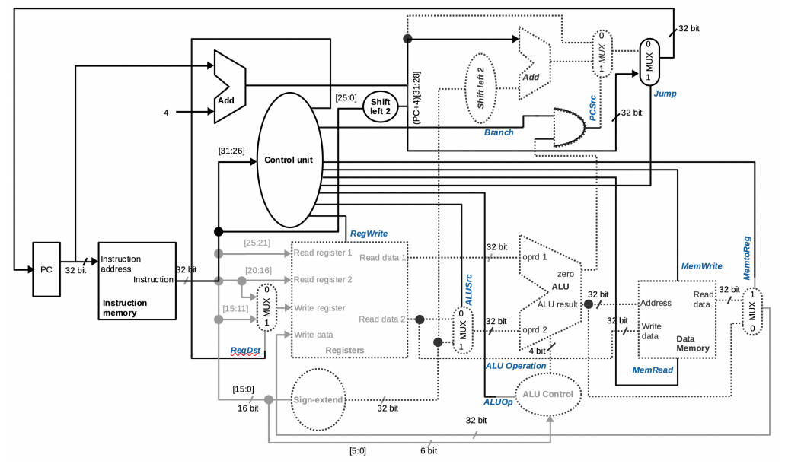

# 32-bit Single-Cycle MIPS Processor

This project is a 32-bit Single-Cycle MIPS processor design, implemented entirely in **SystemVerilog**. 

The project simulates the core datapath and control unit of a basic MIPS CPU, executing instructions from Fetch to Write-back in a single clock cycle.

## 🧠 Architecture (Datapath)

*(Datapath and Control Unit blocks implemented in this design)*

## ⚡ Supported Instructions
The processor currently supports the decoding and execution of the following basic instruction types:
* **R-Type (Arithmetic & Logic):** `ADD`, `SUB`, `AND`, `OR`, `SLT`
* **I-Type (Immediate & Memory Access):** `ADDI`, `ANDI`, `ORI`, `SLTI`, `LW`, `SW`, `BEQ`
* **J-Type (Unconditional Jump):** `J`

## 📂 Repository Structure
* `src/`: Contains all SystemVerilog RTL source code (`datapath.sv`, `alu.sv`, `control_unit.sv`, `register.sv`, etc.).
* `tb/`: Contains the simulation testbench (`datapath_tb.sv`) and the machine code file (`machine_code.txt`) used to initialize the Instruction Memory.

## 🚀 How to Simulate
1. Clone or download the repository to your local machine.
2. Add the `src` folder as Design Sources and the `tb` folder as Simulation Sources in your preferred EDA tool (e.g., Vivado, ModelSim, or Quartus).
3. Ensure `machine_code.txt` is placed in the active simulation directory so the testbench can load the instructions using the `$readmemb` or `$readmemh` system task.
4. Run the simulation on `datapath_tb.sv` to observe the waveform of the registers, ALU operations, and control signals.
